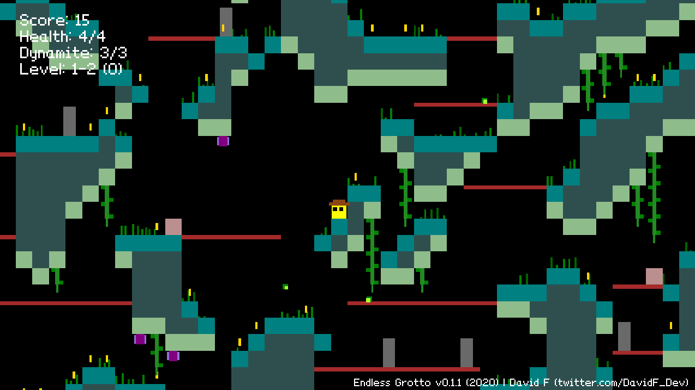
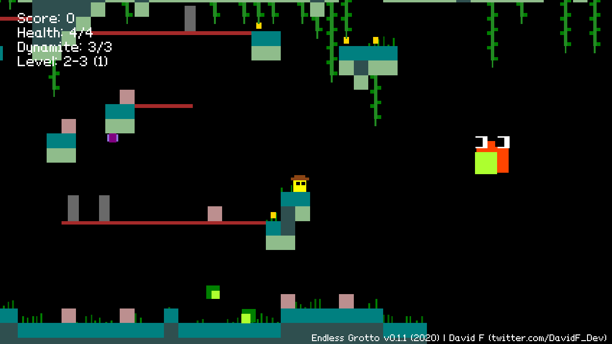

# Endless Grotto (2020)
**Download the latest version in the [Releases](https://github.com/DavidF-Dev/EndlessGrotto-2020/releases) tab.** 

**Gameplay Video - [LINK](https://youtu.be/0MkxZRJvqO4)** 
 

## Caves Filled With Loot And Secrets
The game is a 2D procedurally-generated rogue-like platformer. Cave systems are generated and filled with enemies and loot for the player to explore. Inspired by [Spelunky by Derek Yu](https://spelunkyworld.com), the adventurer in Endless Grotto comes equipped with sticks of dynamite to help get out of tough situations. Also... Watch out for the mini-bosses that are lurking at the end of *special* levels! 

The main objective of the game is to try to get the highest-score possible by collecting coins scattered around the grotto floor, or from killing the hostile creatures. Survival is key! You have 4 hit points to begin with and they can decrease quickly if you're not careful. If you die, the adventure ends and your points are reset. However, you can restore your health by defeating the mini-boss located at the end of every third level. Be smart, calculate the risk vs. reward, and good luck!

## Controls
Left & Right Arrows: Move 
Z: Jump & Double Jump 
X: Throw dynamite 
Down Arrow + Z: Drop down through platforms 
Up Arrow (Hold) + Z: Perform a super-jump 

## Development
The game was developed in C# using the [Nez framework by Prime31](https://github.com/prime31/Nez) that works with [MonoGame](https://www.monogame.net). I made the game by myself, including all the art assets. Sound effects were sourced from [freesoung.org](https://freesound.org) and the music was generated using [Wolfram Tones](https://tones.wolfram.com/generate/).

The caves are procedurally generated using Cellular Automata and then populated with entities. This was my first time using procedural generation in a game and I love it! I've never been great at designing levels by hand, so having that burden lifted allowed me to focus on more exciting things - like bosses!

## Screenshots

 
